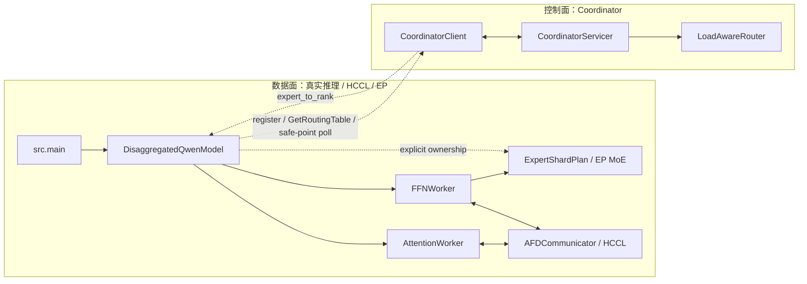

# Coordinator Routing / 负载均衡现状与后续计划

本文聚焦 **Coordinator 控制面下的 routing / 负载均衡**，解释当前仓库里已经实现到哪一步、真实 Qwen3 路径里哪些能力已经接通、哪些地方仍然只是骨架，以及后续实验为什么先以 **synthetic skew / trace-replay** 为主，而不是直接把真实数据集回放设为第一阶段主路径。

---

## 1. 当前结论

先给结论：

1. 当前真实 Qwen3 decode/prefill 路径已经支持 `--routing-backend coordinator`，但**已验证的是 one-shot routing**，不是动态负载均衡。
2. 当前 `expert_to_rank` 在真实 EP 路径里的语义更接近 **“expert ownership / shard placement”**，而不是“每步都可自由改写的 dispatch 目标”。
3. 虽然代码里已经有 `LoadAwareRouter`、`UpdateMetrics`、`routing-update-mode=poll`，但 **real path 还没有形成闭环的 load-aware rebalancing**：
   - 真实 Qwen3 路径当前只会在初始化时拉表；poll 只是在 safe point 拉一次最新表。
   - 如果新表改变了 EP ownership，decode 路径会**拒绝切换**，因为 live expert migration 还没实现。
   - router 需要的 metrics 目前主要只在 skeleton worker 路径里上报，真实 `src.main` 路径还没有同等级的 queue / per-expert load 上报。
4. 因此，当前最合理的推进顺序不是直接跑真实数据集，而是：
   - **第一阶段**：用 synthetic skew / trace-replay 验证 routing 机制是否真的会重排、safe point 是否稳定、指标是否可观测；
   - **第二阶段**：再用真实数据或真实 trace 回放验证“这个机制在实际 workload 上是否仍有收益”。

---

## 2. Coordinator 当前设计与作用

Coordinator 的定位是 **MoE routing 的控制面**，不是数据面。它不负责转发 token hidden states，也不参与 Attention→FFN 或 FFN→Attention 的张量通信；真实数据面仍由 `src/model/*`、`src/distributed/*` 和 EP/HCCL communicator 完成。

它当前解决的是另一类问题：

1. **统一管理 worker 与 routing metadata**
   - FFN/Attention rank 可以向 Coordinator 注册自己的 role、rank、host、device、local experts。
   - Coordinator 保存 worker registry，并通过 stale sweep 剔除长时间不上报的 worker。
2. **把 expert placement 从“写死在启动参数里”变成“可由控制面发布”**
   - static EP7 用 `round_robin` / `contiguous` 规则决定 expert 分片。
   - coordinator 模式用 `expert_to_rank` 表描述每个 expert 的 owner rank。
   - 真实 Qwen3 路径启动时通过 `CoordinatorClient.GetRoutingTable` 拉表，并把它转成 `ExpertShardPlan(policy="explicit")`。
3. **为后续负载均衡提供 metrics 与 rebalance 入口**
   - worker 可通过 `UpdateMetrics` 上报 queue、dispatch rate、per-expert load。
   - `LoadAwareRouter` 可根据这些 metrics 计算新的 `expert_to_rank`。
   - 当前真实路径还没把 metrics 喂满，但控制面接口和 skeleton worker 路径已经存在。
4. **为跨机实验提供可审计的控制面边界**
   - `oneshot`：初始化时取一次 routing table，适合当前稳定实验。
   - `poll`：在 decode safe point 主线程拉表，避免后台 gRPC 线程干扰真实 NPU/HCCL runtime。

依赖方向上，真实推理路径只依赖 `CoordinatorClient` 这个轻量入口；`CoordinatorServicer` 不反向依赖 `src/model`。这能避免控制面和真实模型形成循环依赖。当前需要特别避免的是把 `src/coordinator_arch/workers/*` skeleton worker 当成真实 Qwen3 worker：它们服务于控制面/通信骨架验证，不等价于 `src/model/attention_worker.py` 和 `src/model/ffn_worker.py` 的真实模型路径。

[Review 关注点] Coordinator 当前是控制面，不是数据面。如果后续有人把 hidden state 传输逻辑塞进 Coordinator，会把控制面和性能关键路径耦合，破坏当前分层。

---

## 3. 当前代码里 routing 是怎么接进去的

### 3.1 控制面已有的组件

当前仓库里，Coordinator 控制面相关实现已经具备以下组件：

| 组件 | 位置 | 当前作用 |
|---|---|---|
| gRPC server | `src/coordinator_arch/coordinator_server.py` | worker 注册、返回 routing table、接收 metrics、触发 rebalance |
| gRPC client | `src/coordinator_arch/coordinator_client.py` | worker 侧拉表 / 订阅 / 上报 metrics |
| rebalance 算法 | `src/coordinator_arch/router.py` | 根据 `queue_len_avg + dispatch_rate_tps * weight` 做贪心装箱和限步平滑 |
| routing CLI | `src/main.py` | 暴露 `--routing-backend/--coord-addr/--routing-update-mode/--routing-poll-interval-steps/--routing-rpc-timeout-s` |
| real-path 接线 | `src/model/disaggregated.py` | 初始化时取表、decode safe point poll、把 `expert_to_rank` 下沉到 FFN worker 初始化 |

也就是说，**“控制面能发表、业务路径能取表”** 这部分已经成立。

### 3.2 真实 Qwen3 路径里 `expert_to_rank` 的当前语义

当前真实路径里，`expert_to_rank` 最重要的用途不是“每个 token dispatch 时临时决定去哪台机器”，而是：

1. 模型初始化时取到 coordinator table；
2. 在 EP 模式下把 table 传给 `FFNWorker(..., expert_to_rank=...)`；
3. `FFNWorker` 基于这张表构造 `ExpertShardPlan`，决定**当前 rank 实际加载/持有哪组 experts**。

也就是说，在当前实现中：

- `expert_to_rank` 决定的是 **哪个 FFN EP rank 持有哪个 expert 的权重**；
- 它不是一个仅影响 dispatch 路由、却不影响权重布局的“轻量表”。

这点非常关键，因为它直接决定了后续“动态负载均衡”不能只靠多拉几次表就成立。

### 3.3 `poll` 为什么现在还不等于“动态负载均衡”

真实 decode 路径里的 safe-point poll 逻辑在 `src/model/disaggregated.py`：

- 只有 `routing_update_mode == "poll"` 时才会按步数间隔拉表；
- 如果拉到的新表版本号没变，就直接跳过；
- 如果在 EP 模式下发现 **新表改变了 `expert_to_rank` ownership**，当前代码会记录 warning，然后继续沿用旧表。

原因也很直接：当前实现没有 live expert migration。  
如果某个 decode step 中途把 expert 3 从 rank1 改到 rank5，但 rank5 并没有那份权重，业务路径就会立刻不一致。

所以当前 `poll` 模式的真实能力更接近：

- 可以在 decode safe point 拉取 coordinator table；
- 可以接受**不改变 ownership** 的元数据更新；
- **不能**在真实 EP decode 过程中完成 ownership 迁移式重平衡。

---

## 4. 当前 router 为什么还没有在真实路径里形成闭环

### 4.1 server/router 侧已有 rebalance 触发条件

`CoordinatorServicer.UpdateMetrics()` 收到 worker metrics 后会尝试触发 `_maybe_rebalance()`，内部调用 `LoadAwareRouter.rebalance(...)`。

router 当前使用的输入主要是：

- `queue_len_avg`
- `dispatch_rate_tps`
- `per_expert_load`（如果有）

如果负载不均衡超过阈值，就会给出一张新的 `expert_to_rank`。

### 4.2 但真实 Qwen3 路径并没有把这些 metrics 真正喂满

目前可见的 `coord.update_metrics(...)` 调用点主要在：

- `src/coordinator_arch/workers/attention_worker.py`
- `src/coordinator_arch/workers/ffn_worker.py`

这两处属于早期 skeleton worker 路径，更多是为了：

- 保持 worker 不被 stale-sweep 回收；
- 给 coordinator 一个基本 heartbeat；
- FFN 侧带一个非常简化的 `queue_len_avg`。

而当前真实 Qwen3 NPU 实验主路径走的是 `src.main -> src/model/disaggregated.py`，并不是这套 skeleton worker 服务循环。  
因此，**router 虽然存在，但 real path 还没有稳定、持续、可解释的 load metrics 上报链路**。

这意味着当前状态更准确的表述应该是：

- **one-shot control-plane plumbing 已经通了**
- **real-path dynamic load balancing 还没闭环**

而不是“我们已经实现了动态负载均衡，只差跑实验”

---

## 5. 当前 one-shot 结果到底证明了什么

截至目前，单机 1A7F / EP7 real decode 路径已经证明：

1. `coordinator -> routing table -> explicit expert ownership -> real FFN shard init` 这条链是通的；
2. coordinator one-shot 与 static EP7 可以在同一真实路径下做 apples-to-apples 对比；
3. 当前 one-shot coordinator 在部分配置上可以优于 static，但它本质上仍接近 static round-robin ownership，不应被解读成动态路由收益。

它**没有**证明的事情包括：

1. poll 模式在真实 decode loop 中稳定；
2. 路由表会因为负载变化而发生真实有效的重排；
3. ownership 变化后的 live 切换可行；
4. 真实业务 workload 下 dynamic routing 比 static 有确定收益。

---

## 6. 为什么第一阶段不把真实数据集作为主路径

### 6.1 因为当前还在验证“机制是否存在”

在真实数据集上直接跑 routing 实验，看起来更“真实”，但对于当前阶段并不是最高效的选择。  
原因是当前还有多个机制层问题没有 isolate：

1. router 的 metrics 闭环还没接到 real path；
2. poll 能否稳定拉表与计时还没验证；
3. ownership change 当前会被拒绝；
4. 跨机实验还叠加了 HCCL / TBE JIT / warm cache / network 波动。

如果现在直接上真实数据集，最后即使结果“不好”，也很难判断到底是：

- 路由机制没生效；
- 指标口径错了；
- 数据集负载太平；
- 还是 compile / network 噪声盖掉了收益。

### 6.2 synthetic skew / trace-replay 更适合第一阶段

第一阶段应该优先选择 **可控、可复现、可放大不均衡** 的 workload：

| 工作负载 | 作用 | 为什么适合第一阶段 |
|---|---|---|
| synthetic skew | 主动制造热点 expert / 热点 rank | 能验证 router 是否真的想重排、是否过度抖动 |
| trace-replay | 重放真实请求长度/到达节奏，但不必依赖完整业务数据集 | 更接近线上负载，同时仍保留可复现性 |
| 真实数据集 | 验证最终外部有效性 | 适合第二阶段，不适合作为机制 bring-up 的唯一入口 |

因此，本轮设计上的明确选择是：

- **第一阶段主路径：synthetic skew + trace-replay**
- **第二阶段验证：真实数据集或真实 trace 回放**

---

## 7. 后续路线图

### Phase A — 文档与观测先行

目标：先把“能不能测明白”解决。

1. 补 routing 设计文档（本文档）。
2. 明确当前 real path 缺哪些 metrics：
   - FFN queue/backlog
   - per-expert load
   - dispatch tokens/sec
   - poll 次数与耗时
3. 明确跨机实验还需要的系统级指标：
   - MFU
   - 网络 payload / 带宽利用率

### Phase B — 让 real path 至少具备可观测的 poll 闭环

目标：不是马上追求收益，而是先回答“动态路径是否真的在动”。

建议最小工作包括：

1. 在真实 Qwen3 路径里补 metrics 上报，而不是只依赖 skeleton worker heartbeat。
2. 让 decode summary / timing JSON 明确记录：
   - `routing_backend`
   - `routing_update_mode`
   - `routing_table_version`
   - `routing_poll_count`
   - `routing_poll_ms`
   - 后续新增的 queue / load 指标
3. 先验证 `poll` 模式在**不改变 ownership** 的情况下不会引入明显回退。

### Phase C — 明确“动态路由”到底选哪种语义

这是后续设计里最关键的分叉点。

为什么会走到“expert ownership 在线迁移”这个问题：

- 负载均衡想解决的是某些 expert / rank 过热，另一些 rank 空闲。
- 但 MoE expert 不是纯路由标签，而是带权重的计算单元。
- 当前 explicit EP 分片里，`expert_to_rank[e] = r` 表示 rank `r` **实际持有并执行** expert `e`。
- 因此如果 router 想把热点 expert 17 从 rank3 挪到 rank5，仅仅把表改成 `expert_to_rank[17] = 5` 不够；rank5 必须先拿到 expert 17 的权重，并且所有相关 rank 必须在同一个版本边界后再开始把 token 发给 rank5。

所以 expert 在线迁移不是额外复杂化，而是 **动态负载均衡要在不中断服务的情况下真正改变 expert placement 时必须具备的能力**。如果不做在线迁移，就只能选择更保守的 epoch-level / stop-the-world rebalance。

#### 路线 C1：epoch-level / stop-the-world ownership rebalance

思路：

- 只在请求边界、实验轮次边界或显式同步点重排 `expert_to_rank`；
- 重排后重新构建/重启 FFN shard；
- 不追求 decode loop 中的 live migration。

优点：

- 最贴合当前代码语义；
- 实现风险低；
- 适合先验证“换一种 ownership 会不会改善长时负载均衡”。

缺点：

- 不能做到在线细粒度调度；
- 更像 coarse-grained repartition，而不是真正 per-step dynamic routing。

#### 路线 C2：live ownership migration

思路：

- 允许运行中把 expert ownership 从 rank A 迁到 rank B；
- rank B 在切换前必须拥有目标 expert 的权重，可以是预加载、按需加载、从 rank A 复制，或从共享存储读取；
- rank A / rank B / attention rank / coordinator 必须对 routing table version 达成一致；
- 迁移期间需要 drain in-flight token，避免旧版本 token 发到 rank A、新版本 token 发到 rank B 时 reduce/combine 语义混乱；
- 切换过程最好是两阶段提交：
  1. prepare：目标 rank 加载权重并确认 ready；
  2. commit：所有 rank 在 batch/request boundary 后切到新 version；
- 失败时需要回滚到旧 ownership，而不是留下半迁移状态。

优点：

- 语义最完整，真正支持在线重平衡。

缺点：

- 实现复杂度高；
- 当前代码完全没有这层迁移基础设施；
- 在跨机 1A7F + TBE cache 背景下，调试成本极高。

[Review 关注点] 当前 `maybe_poll_routing_table()` 发现 EP ownership 变化时会拒绝切换，这是正确的保护。任何让 poll 直接接受 ownership change 的改动，都必须同时提供权重迁移、版本一致性和 in-flight token 处理方案。

#### 路线 C3：保持 ownership 静态，仅优化 dispatch 级路由

思路：

- 不变更专家权重放置；
- 只在 token dispatch 策略上做更灵活的分发。

但对当前实现来说，这条路**暂时不可直接落地**，因为当前 explicit sharding 直接把 `expert_to_rank` 绑定成 ownership/source of truth。

综合来看，现阶段最现实的顺序是：

1. 先把 **C1** 做出来，验证 coarse-grained rebalance 是否值得；
2. 如果收益明确，再讨论是否投资 **C2**。

---

## 8. 实验计划

### 8.1 第一阶段：synthetic skew

目标：证明 routing 机制“会动、没抖坏、方向正确”。

建议配置：

1. 固定少数 hotspot experts，占据大部分 token；
2. 人工制造长短请求混部，让某些 FFN rank backlog 明显升高；
3. 比较：
   - static
   - coordinator oneshot
   - coordinator poll（若当前 ownership 不变）

观察指标：

- routing table version 演进
- poll count / poll ms
- queue/backlog 分布
- per-expert load 分布
- TPOT / throughput / overlap-hidden

### 8.2 第二阶段：trace-replay

目标：用更接近真实 workload 的节奏验证第一阶段观察到的趋势。

建议做法：

1. 记录或构造一组请求 trace：
   - prompt len
   - decode len
   - 到达时间 / batch 形成节奏
2. 重放 trace，但不要求一开始就接入完整业务数据集。

### 8.3 第三阶段：真实数据集 / 真实 trace 回放

目标：做外部有效性验证，而不是机制 bring-up。

这里才适合回答：

- dynamic routing 在真实 workload 下是否仍优于 static？
- 收益是否稳定覆盖 compile / communication / scheduling 噪声？

---

## 9. 与跨机 1A7F 实验的关系

routing 与跨机 1A7F 不是两条独立线。

当前跨机实验至少要同时回答三个问题：

1. control-plane + fallback real decode path 是否稳定；
2. 当前 compile 过久问题是否已经通过 warm cache / shape 覆盖被 isolate；
3. 除了 TPOT 之外，MFU 和网络带宽利用率的观测是否成立。

因此，跨机 1A7F 在 routing 视角下的合理定位应该是：

- **先验证观测与机制**
- 再谈“routing 带来的收益”

而不是一上来直接把跨机结果解释成“动态负载均衡有效/无效”。

---

## 10. 当前建议

按优先级排序：

1. 先把 real path 的 metrics / poll 可观测性补齐；
2. 先用 synthetic skew / trace-replay 验证 routing 机制；
3. 并行推进跨机 1A7F，但先把 compile isolate 和 MFU / bandwidth 口径固定；
4. 在 ownership live migration 没实现之前，不把当前 poll 模式包装成“已支持在线动态负载均衡”；
5. 真实数据集验证保留到第二阶段，不作为当前 routing 文档与第一轮实验的硬前置。

---

## 11. 关联文档

- [12-coordinator-arch.md](12-coordinator-arch.md)：Coordinator 总体设计与控制/数据面背景
- [14-communication-modes.md](14-communication-modes.md)：Fallback / DeepEP 通信方式说明
- [15-cross-host-communication-diagnosis.md](15-cross-host-communication-diagnosis.md)：跨机 HCCL / fallback / TBE JIT 现状
- [`results_npu/coordinator_arch/singlehost_ep7/README.md`](../results_npu/coordinator_arch/singlehost_ep7/README.md)：单机 1A7F / EP7 one-shot 对照结果
