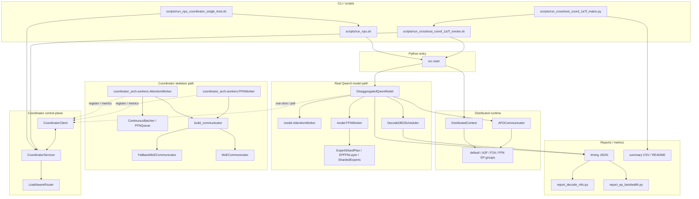
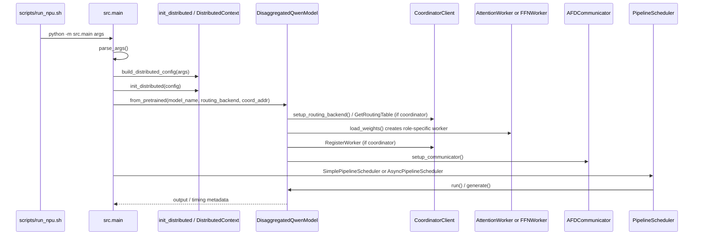
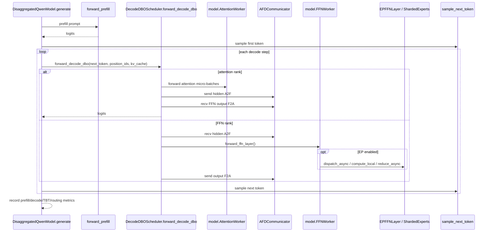
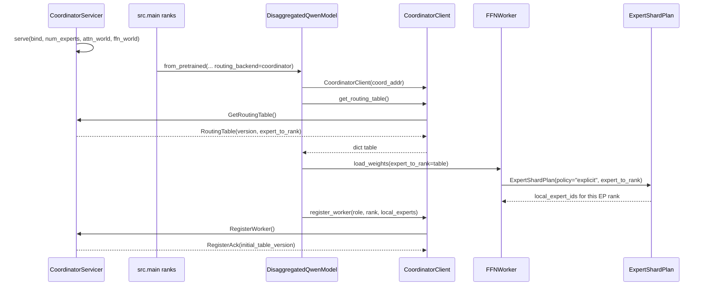
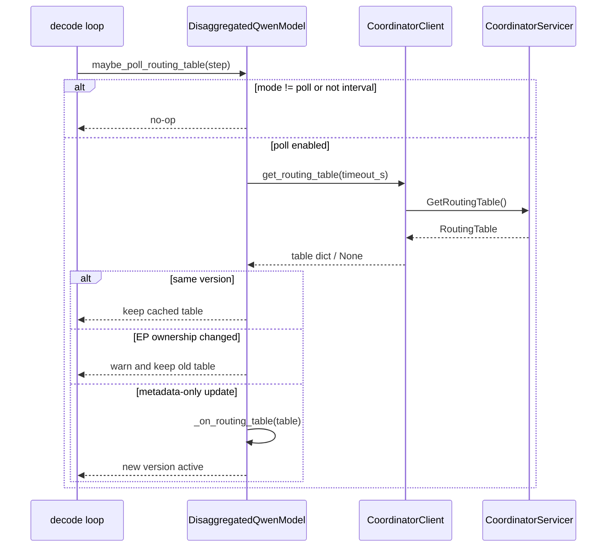
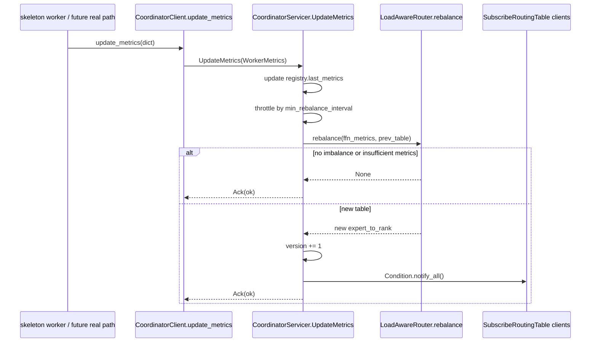
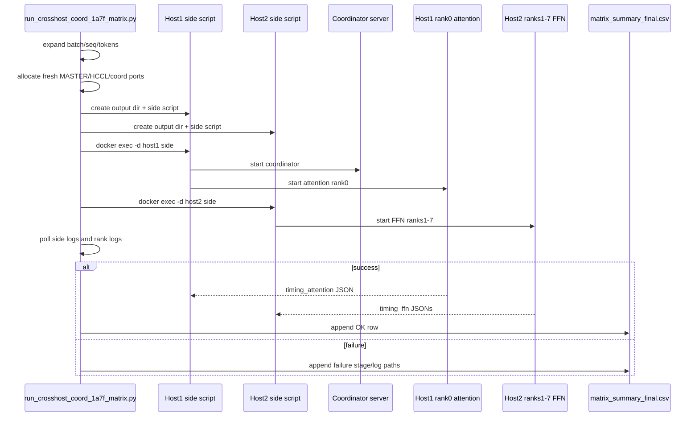

# 代码审查辅助：系统架构与调用链

本文面向代码审查，目标不是复述实验结论，而是帮助 reviewer 快速理解：

- 主要模块如何分层；
- 核心类在运行时如何协作；
- routing / coordinator / EP / DBO 的关键调用链；
- 关键数据结构在哪些方法之间流动并改变状态；
- 哪些位置需要重点 review。

本文基于当前代码库中的真实 Qwen3 推理路径、Coordinator 控制面、skeleton worker / communicator 路径和跨机 orchestrator 编写。行号示例来自当前分支，后续代码变更后应重新核对。

---

## 1. 宏观架构与模块划分

### 1.1 模块职责

| 层级 | 模块 / 文件 | 职责 |
|---|---|---|
| CLI / scripts | `src/main.py`, `scripts/run_npu.sh`, `scripts/run_npu_coordinator_single_host.sh`, `scripts/run_crosshost_coord_1a7f_*.{sh,py}` | 解析实验参数、启动 rank、启动 coordinator、组织单机/跨机矩阵、收集日志和 summary。 |
| Distributed runtime | `src/distributed/__init__.py`, `src/distributed/communicator.py` | 初始化 torch distributed / HCCL groups，维护 rank role、A2F/F2A/EP groups，提供 P2P send/recv buffer。 |
| Real model path | `src/model/disaggregated.py`, `src/model/attention_worker.py`, `src/model/ffn_worker.py`, `src/model/ep_moe.py` | 真实 Qwen3 Attention / FFN / MoE / EP 执行路径；decode-dbo 和 coordinator real-path 都通过这里。 |
| Pipeline schedulers | `src/pipeline/*.py` | Prefill / decode DBO micro-batch 调度、跨层/非跨层 decode pipeline、timing 数据结构。 |
| Coordinator control plane | `src/coordinator_arch/coordinator_server.py`, `coordinator_client.py`, `router.py` | worker registry、routing table、metrics、rebalance、one-shot/poll/subscribe 控制面。 |
| Coordinator skeleton path | `src/coordinator_arch/workers/*`, `batching/*`, `comm/*` | 控制面、batching、fallback/DeepEP communicator 的骨架验证路径；不是当前真实 Qwen3 主推理入口。 |
| Reporting / metrics | `src/utils/timing.py`, `scripts/report_decode_mfu.py`, `scripts/report_ep_bandwidth.py`, aggregation scripts | timing JSON、TBT/TPOT、MFU、EP bandwidth、matrix summary 和图表后处理。 |

### 1.2 Mermaid 组件图

### 1.3 依赖方向与循环依赖

- `scripts/*` 依赖 CLI 和 shell 环境；业务代码不依赖 scripts。
- `src/main.py` 依赖 distributed、model、pipeline、utils。
- `src/model/*` 依赖 distributed runtime、pipeline scheduler 和 utils；在 coordinator 模式下只依赖 `CoordinatorClient`，不依赖 `CoordinatorServicer`。
- `CoordinatorServicer` 依赖 `LoadAwareRouter` 和 proto，不依赖真实模型路径。
- `coordinator_arch/workers/*` 是 skeleton 服务路径，依赖 coordinator client、batching、communicator factory；它不被真实 `src.main -> src/model/*` 主路径调用。
- 当前主要依赖是单向的：`real path -> CoordinatorClient -> gRPC -> CoordinatorServicer -> LoadAwareRouter`。没有必要的 Python import 循环。

[Review 关注点] `src/coordinator_arch/workers/*` 与 `src/model/*` 名字相似，但语义不同：前者是 skeleton / control-plane worker，后者是真实 Qwen3 计算 worker。Review 时不要把 skeleton worker 的 identity FFN/attention 误认为真实推理性能路径。

---

## 2. 核心类与方法交互

### 2.1 真实推理路径核心类

| 类 | 关键方法 | 运行时作用 |
|---|---|---|
| `DisaggregatedQwenModel` | `from_pretrained()` | 创建模型、设置 routing backend、加载权重、注册 coordinator、初始化 communicator。见 `src/model/disaggregated.py:1057-1109`。 |
| `DisaggregatedQwenModel` | `setup_routing_backend()` | static/coordinator routing 策略入口；coordinator 模式创建 `CoordinatorClient` 并拉取 routing table。见 `src/model/disaggregated.py:233-259`。 |
| `DisaggregatedQwenModel` | `refresh_routing_table()` / `maybe_poll_routing_table()` | one-shot 拉表与 decode safe point polling；EP ownership 变化会被拒绝。见 `src/model/disaggregated.py:198-231`。 |
| `DisaggregatedQwenModel` | `load_weights()` | 按 rank role 构造真实 `AttentionWorker` 或 `FFNWorker`；coordinator EP 模式下把 `expert_to_rank` 传给 FFN。见 `src/model/disaggregated.py:279-329`。 |
| `DisaggregatedQwenModel` | `generate()` | autoregressive generation 主循环，prefill 后进入 decode loop，并在每步调用 decode DBO 或普通 decode。见 `src/model/disaggregated.py:768-949`。 |
| `AttentionWorker` | `forward_attention_layer()` / `forward_lm_head()` | 执行真实 attention layer 和输出 logits。 |
| `FFNWorker` | `forward_ffn_layer()` | 执行真实 FFN/MoE；EP 模式下调用 `EPFFNLayer`/`ShardedExperts`。 |
| `ExpertShardPlan` | `local_expert_ids`, `all_assignments()` | 根据 `round_robin` / `contiguous` / `explicit` 计算当前 EP rank 持有哪些 expert。见 `src/model/ep_moe.py:17-78`。 |
| `EPFFNLayer` | `create_work_item()`, `dispatch_async()`, `compute_local()`, `reduce_async()`, `finish_output()` | EP dispatch/reduce overlap 的核心阶段；产生 EP timing。 |
| `AFDCommunicator` | `send_async()`, `recv_async()`, `send_sync()`, `recv_sync()`, `wait_*()` | Attention/FFN 之间 hidden state 的 P2P 通信。 |
| `DecodeDBOScheduler` | `forward_decode_dbo()` | decode DBO micro-batch pipeline 入口；根据 role 走 attention 或 FFN decode path。 |

### 2.2 Coordinator / routing 核心类

| 类 | 关键方法 | 运行时作用 |
|---|---|---|
| `CoordinatorServicer` | `RegisterWorker()` | worker 注册，写入内存 registry，返回当前 routing table version。见 `src/coordinator_arch/coordinator_server.py:83-98`。 |
| `CoordinatorServicer` | `GetRoutingTable()` | one-shot 返回当前 `RoutingTable`。见 `src/coordinator_arch/coordinator_server.py:100-107`。 |
| `CoordinatorServicer` | `SubscribeRoutingTable()` | server-side stream，routing table version 更新时推送。见 `src/coordinator_arch/coordinator_server.py:109-126`。 |
| `CoordinatorServicer` | `UpdateMetrics()` / `_maybe_rebalance()` | 接收 worker metrics，节流后调用 `LoadAwareRouter.rebalance()`，必要时发布新 table。见 `src/coordinator_arch/coordinator_server.py:128-170`。 |
| `CoordinatorServicer` | `sweep_stale_workers()` | 后台剔除长时间不上报 metrics 的 worker，并触发 rebalance。见 `src/coordinator_arch/coordinator_server.py:184-199`。 |
| `CoordinatorClient` | `register_worker()` | 将 Python dict 转成 `WorkerInfo` protobuf 并注册。见 `src/coordinator_arch/coordinator_client.py:64-86`。 |
| `CoordinatorClient` | `get_routing_table()` | unary RPC，返回 Python dict routing table。见 `src/coordinator_arch/coordinator_client.py:89-102`。 |
| `CoordinatorClient` | `subscribe_routing_table()` | 后台线程订阅 stream。真实 NPU decode path 当前不使用它。见 `src/coordinator_arch/coordinator_client.py:104-135`。 |
| `CoordinatorClient` | `update_metrics()` | 将 worker metrics dict 转成 protobuf 上报。见 `src/coordinator_arch/coordinator_client.py:138-153`。 |
| `LoadAwareRouter` | `rebalance()` | 根据 FFN metrics 计算新 `expert_to_rank`；贪心 bin-pack 并限制每次迁移数量。见 `src/coordinator_arch/router.py:40-134`。 |

### 2.3 Coordinator skeleton / communicator 核心类

| 类 | 关键方法 | 运行时作用 |
|---|---|---|
| `CommunicatorProtocol` | `dispatch()`, `combine()`, `update_routing_table()`, `set_mode()` | MoE communicator 策略接口。见 `src/coordinator_arch/comm/factory.py:19-57`。 |
| `build_communicator()` | factory function | 默认构造 `FallbackMoECommunicator`；DeepEP 需显式 opt-in。见 `src/coordinator_arch/comm/factory.py:58-124`。 |
| `FallbackMoECommunicator` | `dispatch()` / `combine()` | 使用 `torch.distributed.all_to_all_single` 做 token movement 和 combine。 |
| `MoECommunicator` | `dispatch()` / `combine()` / `set_mode()` | DeepEP normal / low_latency wrapper；当前 runtime 仍 experimental。 |
| `ContinuousBatcher` | `split()` / `merge()` | skeleton attention worker 中按目标 rank 切分/恢复 token。 |
| `FFNQueue` | `push()` / `pop_batch()` / `should_flush()` | skeleton FFN worker 中按 batch/时间聚合请求。 |

---

## 3. 关键业务流程序列图

### 3.1 `src.main` 启动真实 NPU rank

[Review 关注点] `from_pretrained()` 中 routing setup 在 load weights 前发生，FFN worker 初始化才能拿到 `expert_to_rank`。如果顺序被改成先 load weights 再拉 table，coordinator explicit ownership 会失效。

### 3.2 static decode-dbo 真实路径

[Review 关注点] decode loop 中 `maybe_poll_routing_table(step)` 在 `DecodeDBOScheduler.forward_decode_dbo()` 前执行（`src/model/disaggregated.py:874-890`）。任何 routing 更新都必须保持在这个 safe point 语义内，不能在 layer collective 中异步改状态。

### 3.3 coordinator oneshot real path

### 3.4 coordinator poll safe point

[Review 关注点] `CoordinatorClient.subscribe_routing_table()` 会启动后台线程（`src/coordinator_arch/coordinator_client.py:104-135`）。真实 NPU decode path 当前应使用 oneshot/poll，而不是后台 subscribe；此前后台线程在真实 HCCL/TBE 阶段触发过不稳定行为。

### 3.5 metrics → rebalance → routing table publish

[Review 关注点] 当前真实 Qwen3 path 还没有持续上报 queue/per-expert load；`UpdateMetrics()` 主要由 skeleton worker 路径使用。不要把 router 存在误解为 real-path dynamic load balancing 已闭环。

### 3.6 cross-host 1A7F matrix orchestration

[Review 关注点] Orchestrator failure 与 HCCL/model failure 要分层判断：没有 rank log / 没有 `src.main` PID 属于编排失败，不应等待模型 timeout 或误判为 HCCL。

---

## 4. 类关系 / 调用矩阵

| 调用者类.方法 | 被调用者类.方法 | 调用目的 / 条件 | Review 关注点 |
|---|---|---|---|
| `src.main.main` | `build_distributed_config()` / `init_distributed()` | 根据 CLI/env 初始化 distributed role、rank、EP groups。 | rank layout、`LOCAL_RANK`、EP group 创建顺序必须与脚本一致。 |
| `src.main.main` | `DisaggregatedQwenModel.from_pretrained()` | 构造真实模型路径。 | 参数透传是否覆盖 routing、batch、seq、dtype。 |
| `DisaggregatedQwenModel.from_pretrained` | `setup_routing_backend()` | 在 load weights 前建立 static/coordinator routing 状态。 | 顺序不可随意调整。 |
| `setup_routing_backend` | `CoordinatorClient.get_routing_table()` | coordinator 模式 one-shot 拉表。 | RPC 失败会抛错；实验脚本需先启动 coordinator。 |
| `DisaggregatedQwenModel.load_weights` | `FFNWorker(... expert_to_rank=...)` | 将 coordinator table 下沉到 FFN EP shard 初始化。 | 只在 EP enabled 时传 explicit mapping。 |
| `FFNWorker.__init__` | `ExpertShardPlan.local_expert_ids` | 计算本 rank 持有的 expert 集合。 | explicit mapping 长度和 rank 范围必须校验。 |
| `DisaggregatedQwenModel.generate` | `maybe_poll_routing_table(step)` | decode safe point 拉取新 routing table。 | ownership change 当前必须拒绝。 |
| `DisaggregatedQwenModel.generate` | `DecodeDBOScheduler.forward_decode_dbo()` | 执行 decode DBO micro-batch pipeline。 | timing 与通信 overlap 口径要一致。 |
| `DecodeDBOScheduler.forward_decode_dbo` | role-specific attention/FFN decode methods | 分 rank 执行 attention 或 FFN path。 | attention / FFN 两端步数必须同步。 |
| `FFNWorker.forward_ffn_layer` | `EPFFNLayer.forward()` | EP MoE dispatch/local/reduce。 | raw tensor view、dtype/layout、group 选择较脆弱。 |
| `CoordinatorServicer.UpdateMetrics` | `_maybe_rebalance()` | 收到 metrics 后节流触发 rebalance。 | metrics 不足时不会动；真实 path 未喂满。 |
| `_maybe_rebalance` | `LoadAwareRouter.rebalance()` | 根据 cost 和 per-expert load 计算新 table。 | rank offset 假设为 `global_rank - attn_world`。 |
| `LoadAwareRouter.rebalance` | internal greedy bin-pack | 热点 expert 分配到较空 bin。 | smoothing 只限制 move 数，不保证全局最优。 |
| `CoordinatorClient.subscribe_routing_table` | callback(table) | 后台线程推送更新。 | 不应直接用于真实 NPU decode path。 |
| `build_communicator` | `FallbackMoECommunicator` / `MoECommunicator` | communicator strategy factory。 | DeepEP 是 opt-in experimental。 |
| `FallbackMoECommunicator.dispatch` | `dist.all_to_all_single` | 按 routing table 发送 token/hidden/weights。 | 必须先 `update_routing_table()`。 |
| `ContinuousBatcher.split` | routing table lookup | skeleton path 按目标 rank 切 chunk。 | 仅 skeleton，不等价真实 Qwen path。 |
| `run_crosshost_coord_1a7f_matrix.py` | side shell scripts | 编排跨机 full matrix。 | stale marker、端口、磁盘空间、PID 清理。 |

---

## 5. 数据流与状态变化

### 5.1 `DistributedConfig` → `DistributedContext`

- 来源：`src.main.parse_args()` / env / `build_distributed_config()`。
- 传递：`init_distributed(config)` 初始化全局 `DistributedContext`。
- 状态：
  - rank role：attention / FFN / FFN expert-only；
  - default process group；
  - A2F / F2A directional groups；
  - FFN EP / dispatch / reduce groups；
  - NPU device / local rank。
- [Review 关注点] EP 模式下 `ASCEND_VISIBLE_DEVICES`、物理 `LOCAL_RANK`、global rank、EP rank 需要一致；错配会表现为 HCCL group/bootstrap 或 expert shard 错误。

### 5.2 `routing_table` / `expert_to_rank`

- 来源：
  - Coordinator 初始化时生成 uniform table：`expert_to_rank[e] = e % ffn_world`；
  - `LoadAwareRouter.rebalance()` 可生成新 table；
  - static 模式不走 coordinator table。
- 传递：
  1. `CoordinatorServicer.GetRoutingTable()` 返回 protobuf；
  2. `CoordinatorClient.get_routing_table()` 转成 Python dict；
  3. `DisaggregatedQwenModel._on_routing_table()` 存到 `self.routing_table`；
  4. `coordinator_expert_to_rank` 传给 `FFNWorker`；
  5. `ExpertShardPlan(policy="explicit")` 转成 `local_expert_ids`。
- 状态变化：
  - `routing_table_version` 记录版本；
  - `routing_poll_count` / `routing_poll_ms` 记录 poll 开销；
  - EP ownership 改变目前不会在线生效。
- [Review 关注点] 对当前 real path 来说，`expert_to_rank` 是 ownership/source of truth，不只是 dispatch hint。任何动态改表都要考虑权重是否已在目标 rank。

### 5.3 `hidden_states`

- 来源：
  - prefill/decode 中 attention layer 输出；
  - decode DBO micro-batch 切分后的 per-MB hidden。
- 传递：
  - attention rank 通过 `AFDCommunicator` 发送 A2F；
  - FFN rank 接收后执行 FFN/MoE；
  - FFN rank 通过 F2A 返回；
  - attention rank 继续下一层或 lm head。
- 转换：
  - EP 模式下 `EPFFNLayer` 会将 hidden reshape/flatten，并与 `selected_experts`、routing weights 一起进入 dispatch/reduce。
- [Review 关注点] `AFDCommunicator` buffer shape、dtype、tag、micro-batch 顺序必须在 attention/FFN 两侧完全一致。

### 5.4 `topk_indices` / routing weights / EP timing

- 来源：MoE router / gate。
- 传递：
  - `FFNLayer.forward()` / `EPFFNLayer.create_work_item()`；
  - dispatch 阶段用于确定专家；
  - reduce/combine 阶段用于加权。
- 状态：
  - `EPStageTiming` 记录 dispatch、local expert、reduce、overlap-hidden、bytes。
  - 后处理脚本从 timing JSON 汇总 EP bandwidth。
- [Review 关注点] EP fused broadcast 使用 raw byte view 时，对 tensor layout/dtype 变化敏感；修改 MoE tensor shape 后需重点审查。

### 5.5 worker metrics

- 来源：
  - skeleton attention/FFN worker heartbeat；
  - future real path metrics 尚待补齐。
- 传递：
  - `CoordinatorClient.update_metrics()` → `CoordinatorServicer.UpdateMetrics()` → `_maybe_rebalance()`。
- 字段：
  - `queue_len_avg`
  - `dispatch_rate_tps`
  - `cache_miss_rate`
  - `per_expert_load`
- [Review 关注点] 当前 router 的 rank 解释假设 FFN global rank 以 `attn_world` 为 offset；新拓扑必须核对 rank numbering。

### 5.6 timing JSON / summary CSV

- 来源：
  - `DisaggregatedQwenModel.generate()` 记录 prefill/decode/TBT/routing 字段；
  - decode scheduler 记录 per-layer/per-MB timing；
  - matrix orchestrator 汇总每个 config 的 status 和路径。
- 消费：
  - `plot_all_pipelines.py`
  - `analyze_decode_l0_warmup.py`
  - `report_decode_mfu.py`
  - `report_ep_bandwidth.py`
  - comparison README / CSV。
- [Review 关注点] L0 warmup 与 no-L0 图的口径要区分；不要用 pipeline 图的单步明细替代 matrix TPOT 结论。

---

## 6. 三层以上调用链示例

### 6.1 real decode-dbo step

- `src.main.main`
  - `PipelineScheduler.run`
    - `DisaggregatedQwenModel.generate`
      - `maybe_poll_routing_table`
      - `DecodeDBOScheduler.forward_decode_dbo`
        - attention rank:
          - `AttentionWorker.forward_attention_layer`
          - `AFDCommunicator.send_async`
          - `AFDCommunicator.recv_async`
          - `AttentionWorker.forward_lm_head`
        - FFN rank:
          - `AFDCommunicator.recv_async`
          - `FFNWorker.forward_ffn_layer`
            - `FFNLayer.forward`
              - `EPFFNLayer.forward`
                - `dispatch_async`
                - `compute_local`
                - `reduce_async`
                - `finish_output`
          - `AFDCommunicator.send_async`

### 6.2 coordinator oneshot initialization

- `scripts/run_npu_coordinator_single_host.sh`
  - `scripts/launch_coordinator.sh`
    - `CoordinatorServicer.serve`
      - `CoordinatorServicer.__init__`
      - `sweep_stale_workers` background task
  - `scripts/run_npu.sh`
    - `src.main.main`
      - `DisaggregatedQwenModel.from_pretrained`
        - `setup_routing_backend`
          - `CoordinatorClient.__init__`
          - `CoordinatorClient.get_routing_table`
        - `load_weights`
          - `FFNWorker(... expert_to_rank=...)`
            - `ExpertShardPlan(policy="explicit")`
        - `_register_with_coordinator`
          - `CoordinatorClient.register_worker`
        - `setup_communicator`

### 6.3 metrics-driven rebalance

- `coordinator_arch.workers.FFNWorker` or future real metrics hook
  - `CoordinatorClient.update_metrics`
    - `CoordinatorServicer.UpdateMetrics`
      - `_maybe_rebalance`
        - `LoadAwareRouter.rebalance`
          - aggregate rank cost
          - greedy bin-pack experts
          - cap moved experts
        - update `RoutingTable(version + 1)`
        - notify `SubscribeRoutingTable` waiters

### 6.4 cross-host matrix

- local `run_crosshost_coord_1a7f_matrix.py`
  - expand config matrix
  - allocate fresh ports
  - write Host1/Host2 side scripts
  - `docker exec -d` Host1 side
    - start coordinator
    - start rank0 attention
  - `docker exec -d` Host2 side
    - start ranks1-7 FFN
  - poll side logs / markers
  - collect timing JSON and append summary row

---

## 7. 设计模式与交互角色

| 模式 | 代码位置 | 角色说明 | Review 关注点 |
|---|---|---|---|
| Strategy | `--routing-backend static|coordinator`, `--routing-update-mode oneshot|poll` | 同一真实推理路径可切换 routing 策略。 | 新 strategy 不应破坏 static baseline。 |
| Strategy | `ExpertShardPlan(policy=round_robin|contiguous|explicit)` | expert ownership 分配策略。 | explicit policy 必须校验 table。 |
| Strategy / Factory | `build_communicator(prefer_deepep=...)` | 在 fallback 和 DeepEP communicator 间选择。 | DeepEP 仍 experimental，默认不应误切。 |
| Facade / Orchestrator | `DisaggregatedQwenModel` | 封装 model workers、distributed communicator、routing state、decode scheduler。 | 类职责较重；改动需关注跨模块副作用。 |
| Observer / Pub-Sub | `SubscribeRoutingTable` | server-side stream 推送 routing table。 | 真实 NPU path 当前不应使用后台线程订阅。 |
| Adapter | `CoordinatorClient` | protobuf/gRPC 与 Python dict 之间转换。 | schema drift 会导致字段缺失或语义不一致。 |
| Adapter | `MoECommunicator` | DeepEP API 到统一 communicator protocol 的适配。 | normal/low_latency API 差异大，测试覆盖必须强。 |
| Producer / Consumer | `FFNQueue` | skeleton FFN worker 聚合请求。 | 只用于 skeleton path；不要直接推断真实 Qwen latency。 |

---

## 8. Review 关注点汇总

1. **真实路径 vs skeleton 路径**
   - `src/model/*` 是真实 Qwen 路径。
   - `src/coordinator_arch/workers/*` 是 skeleton/control-plane 验证路径。
   - 二者不要混淆。

2. **Coordinator 是控制面**
   - 它发布 routing table、收 metrics、做 rebalance。
   - 它不应该进入 hidden state 数据面。

3. **poll 不等于在线动态负载均衡**
   - `poll` 可以拉新 table。
   - EP ownership 改变当前会被拒绝。
   - 真正在线迁移需要权重加载/复制、两阶段提交、in-flight token drain 和回滚。

4. **后台 subscribe 风险**
   - `subscribe_routing_table()` 会启动后台线程。
   - 真实 NPU decode path 当前应使用主线程 safe-point polling。

5. **EP / HCCL group 和 device mapping**
   - rank、local rank、visible devices、EP rank、group rank 必须一致。
   - 跨机/单机脚本改动后要重点看启动环境与 `DistributedContext` 解释是否一致。

6. **DeepEP 默认路径**
   - `build_communicator()` 默认 fallback。
   - DeepEP 是 opt-in experimental，当前跨机 runtime 问题尚未解除。

7. **timing 口径**
   - matrix summary 的 TPOT/throughput 是性能结论主口径。
   - pipeline 图用于解释 overlap；no-L0 图用于剔除冷启动/首层扰动。

8. **Orchestrator failure 分层**
   - 没有 rank PID/log 是编排失败。
   - HCCL `EJ0003/EI0006` 是通信层。
   - 卡在 warmup / kernel_meta 是 TBE/JIT 层。
   - OOM / disk pressure 另行分类。

---

## 9. 建议 Review 顺序

1. 先看 `src/main.py` 的 CLI 参数如何进入 `DisaggregatedQwenModel.from_pretrained()`。
2. 再看 `src/model/disaggregated.py`：
   - `setup_routing_backend`
   - `load_weights`
   - `generate`
   - `maybe_poll_routing_table`
3. 再看 `src/model/ffn_worker.py` 和 `src/model/ep_moe.py`，确认 explicit ownership 如何决定本 rank experts。
4. 再看 `src/distributed/__init__.py` 和 `communicator.py`，确认 groups、rank、tags、buffer。
5. 再看 `src/coordinator_arch/coordinator_server.py` / `coordinator_client.py` / `router.py`，理解控制面 table 如何生成与更新。
6. 最后看 `scripts/run_crosshost_coord_1a7f_matrix.py` 和 `run_crosshost_coord_1a7f_smoke.sh`，确认实验启动、日志、清理和 summary 是否与代码路径一致。

