# Pipeline figures — decode-dbo-crosslayer

## `decode-dbo-crosslayer_b128_s128_t20`

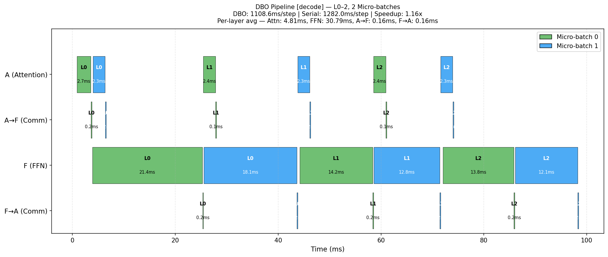

## `decode-dbo-crosslayer_b128_s256_t20`

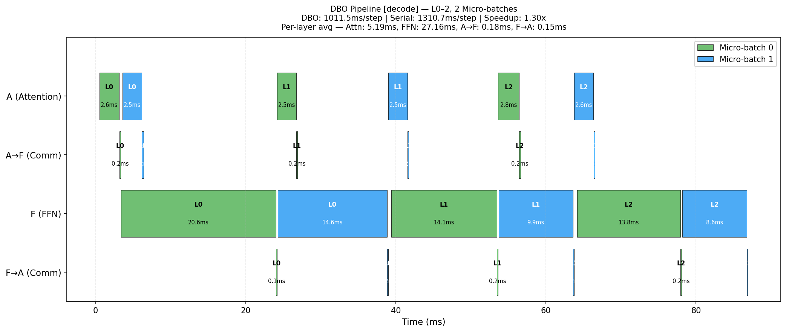

## `decode-dbo-crosslayer_b128_s512_t20`

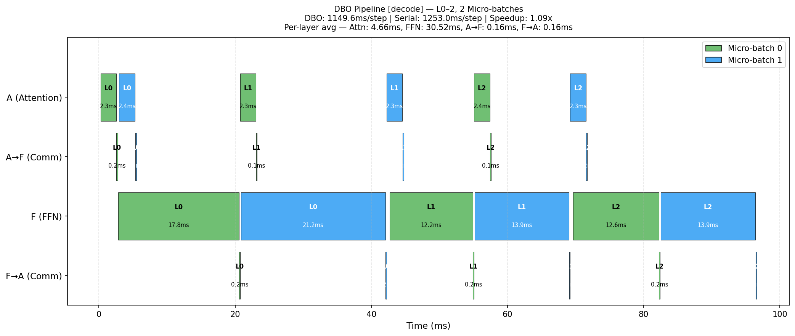

## `decode-dbo-crosslayer_b16_s128_t20`

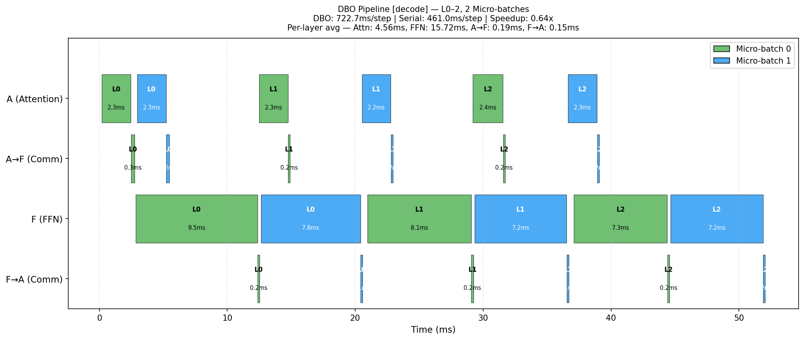

## `decode-dbo-crosslayer_b16_s256_t20`

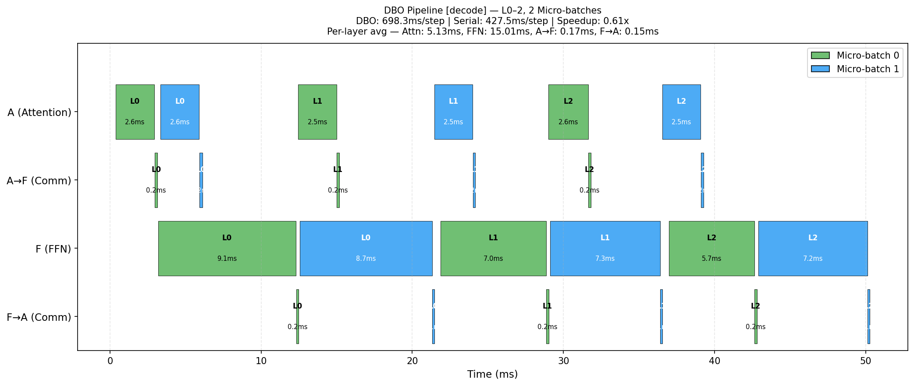

## `decode-dbo-crosslayer_b16_s512_t20`

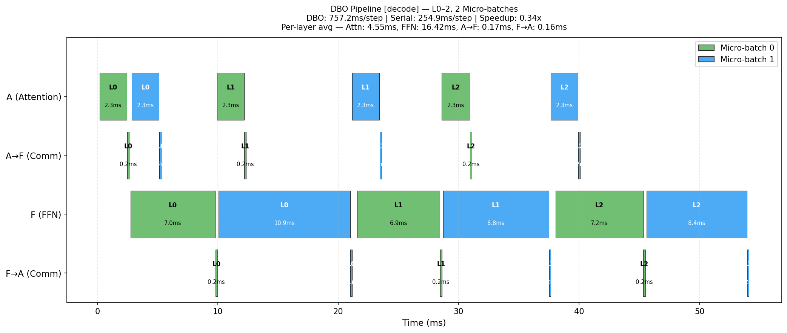

## `decode-dbo-crosslayer_b2_s128_t20`

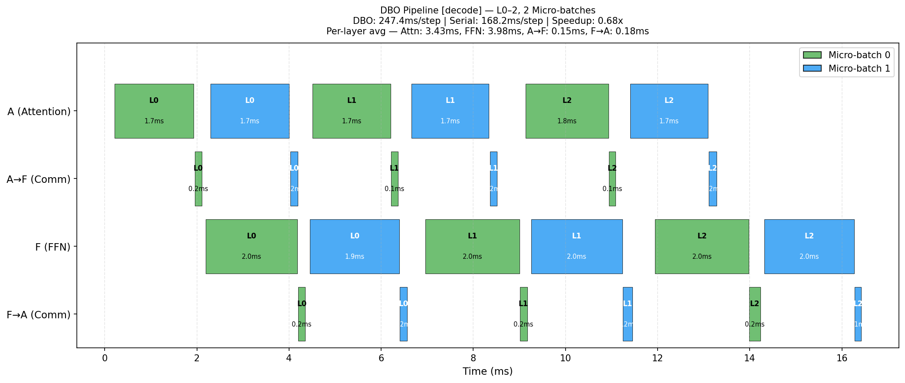

## `decode-dbo-crosslayer_b2_s256_t20`

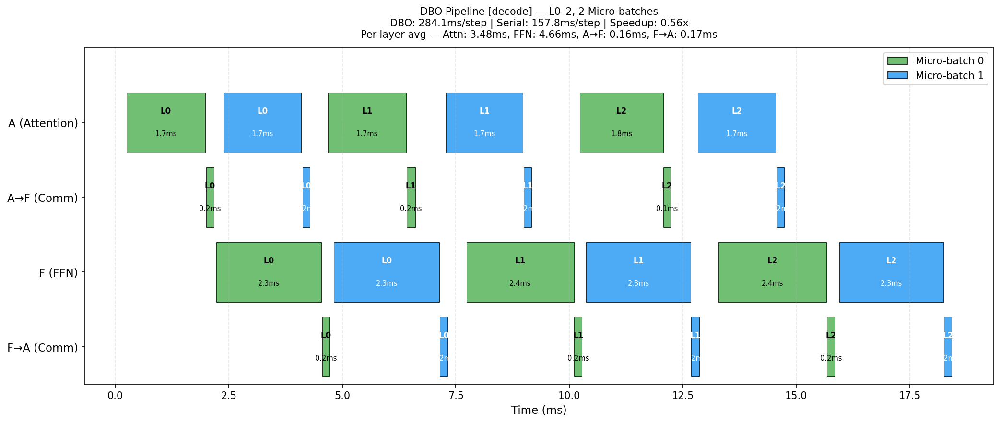

## `decode-dbo-crosslayer_b2_s512_t20`

## `decode-dbo-crosslayer_b32_s128_t20`

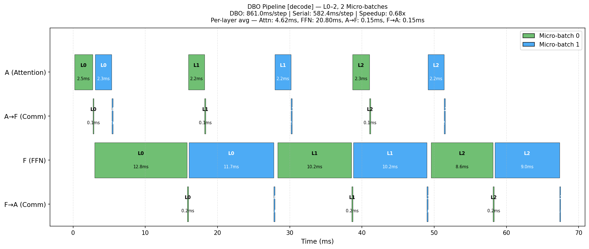

## `decode-dbo-crosslayer_b32_s256_t20`

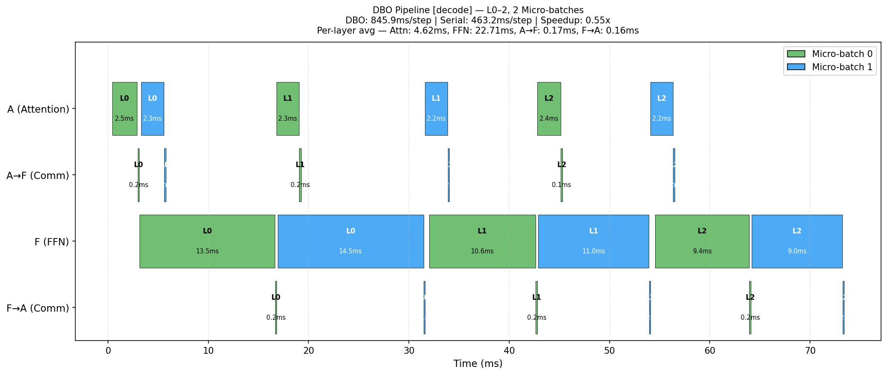

## `decode-dbo-crosslayer_b32_s512_t20`

## `decode-dbo-crosslayer_b4_s128_t20`

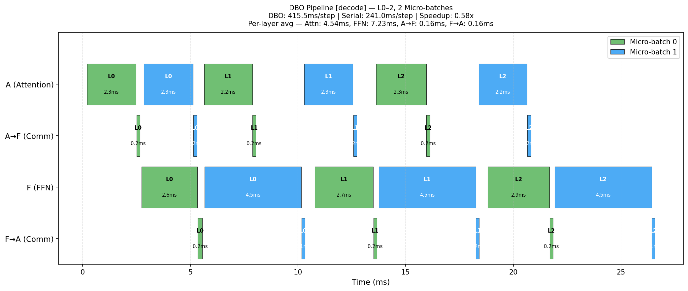

## `decode-dbo-crosslayer_b4_s256_t20`

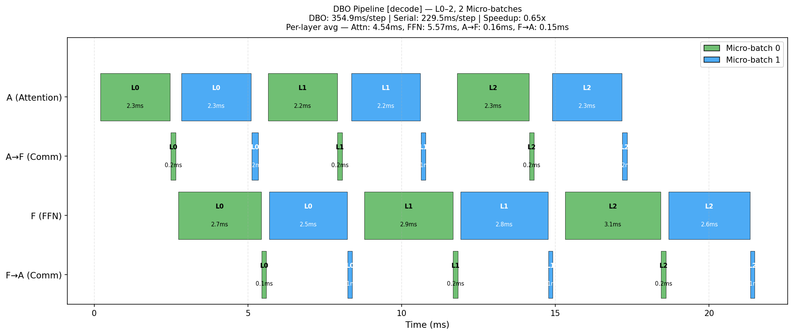

## `decode-dbo-crosslayer_b4_s512_t20`

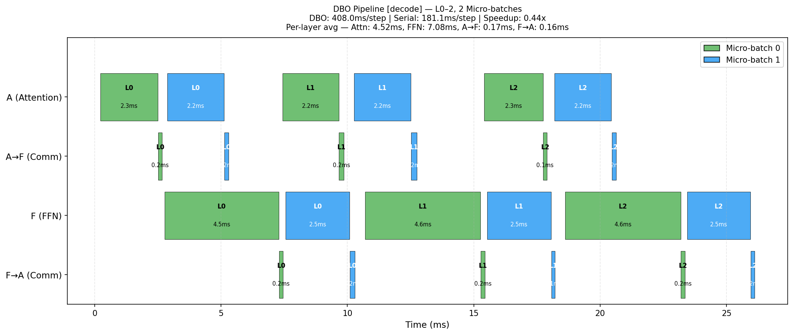

## `decode-dbo-crosslayer_b64_s128_t20`

## `decode-dbo-crosslayer_b64_s256_t20`

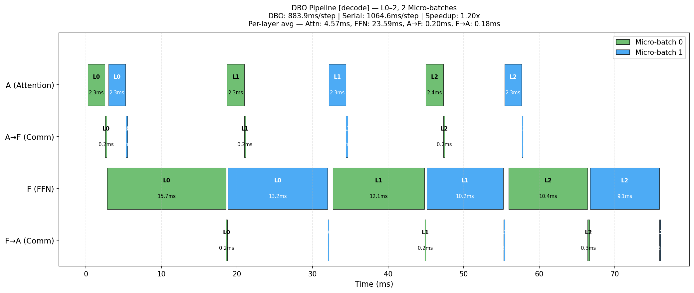

## `decode-dbo-crosslayer_b64_s512_t20`

## `decode-dbo-crosslayer_b8_s128_t20`

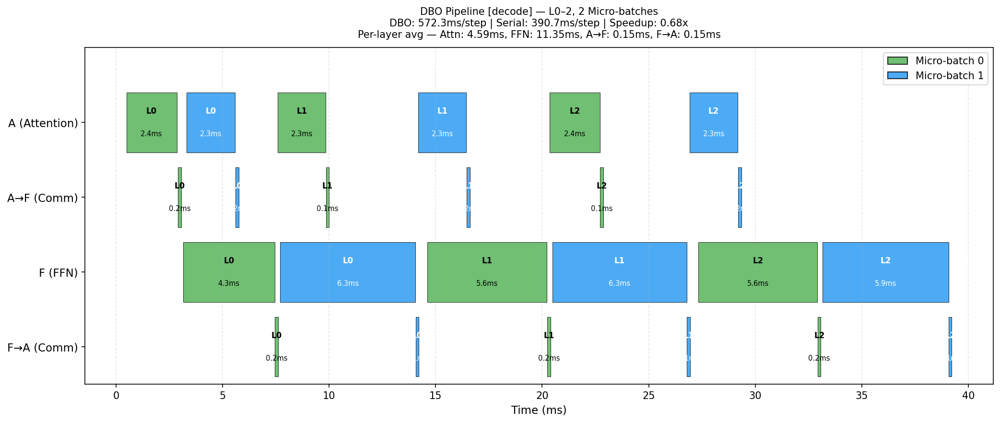

## `decode-dbo-crosslayer_b8_s256_t20`

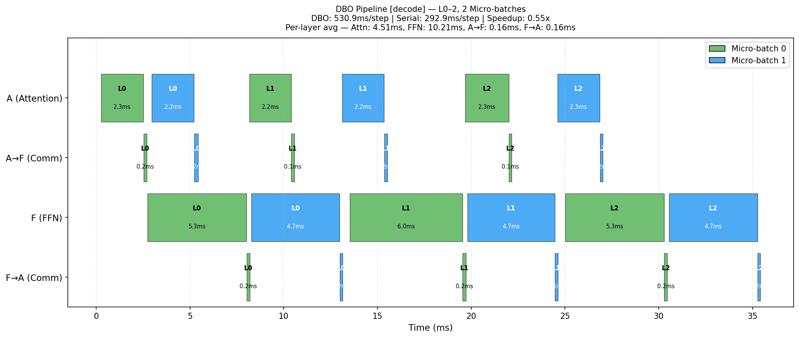

## `decode-dbo-crosslayer_b8_s512_t20`

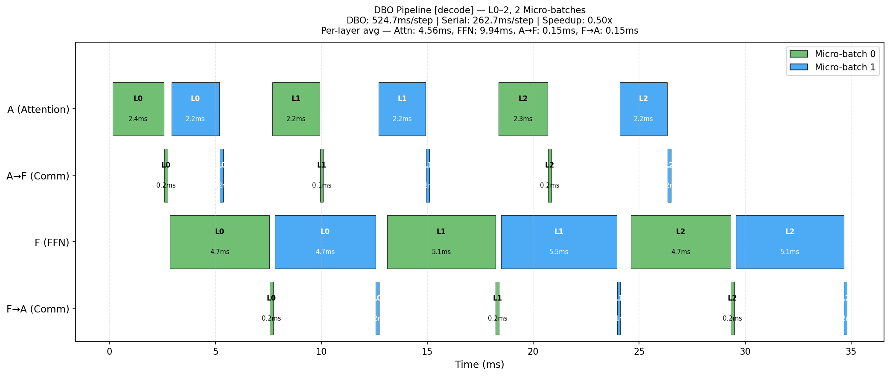

## `decode-dbo-crosslayer_b96_s128_t20`

## `decode-dbo-crosslayer_b96_s256_t20`

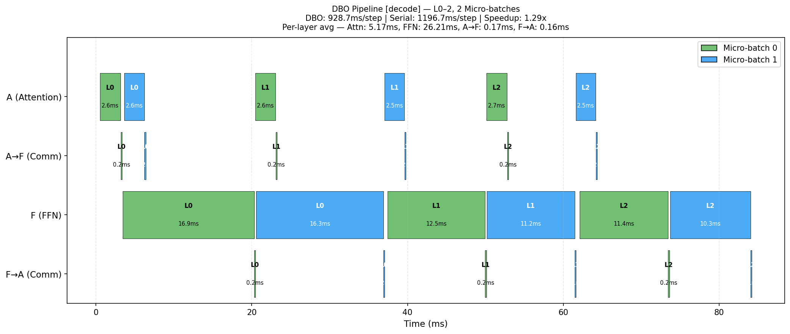

## `decode-dbo-crosslayer_b96_s512_t20`

