# Pipeline figures — decode-dbo

## `decode-dbo_b128_s128_t20`

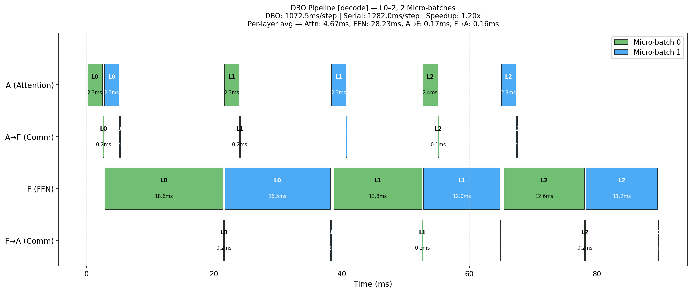

## `decode-dbo_b128_s256_t20`

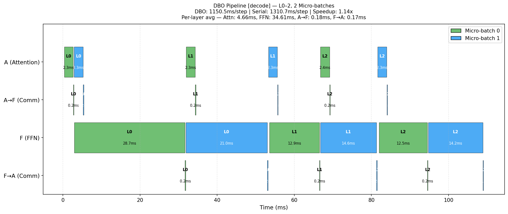

## `decode-dbo_b128_s512_t20`

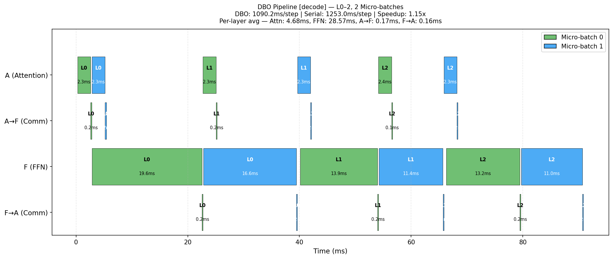

## `decode-dbo_b16_s128_t20`

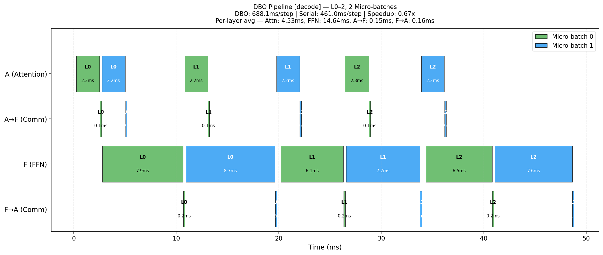

## `decode-dbo_b16_s256_t20`

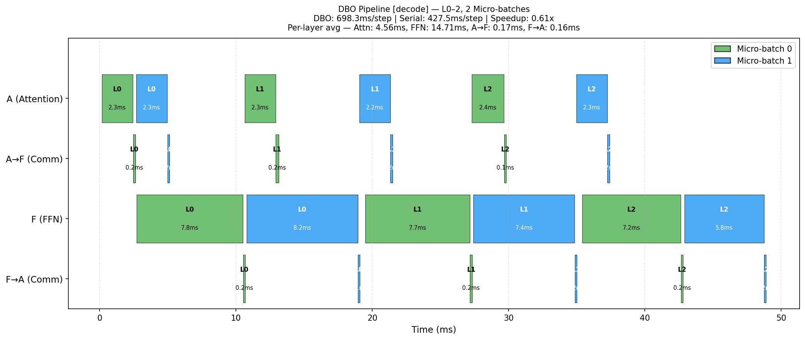

## `decode-dbo_b16_s512_t20`

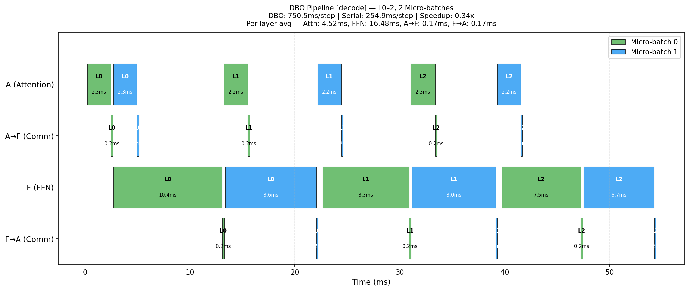

## `decode-dbo_b2_s128_t20`

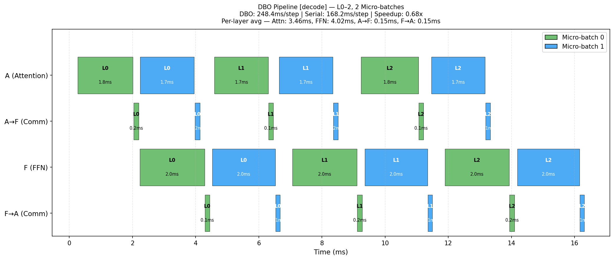

## `decode-dbo_b2_s256_t20`

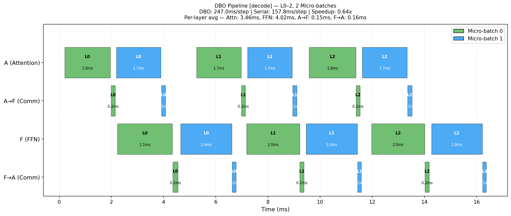

## `decode-dbo_b2_s512_t20`

## `decode-dbo_b32_s128_t20`

## `decode-dbo_b32_s256_t20`

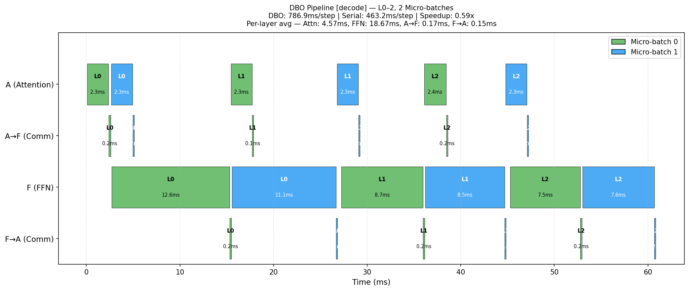

## `decode-dbo_b32_s512_t20`

## `decode-dbo_b4_s128_t20`

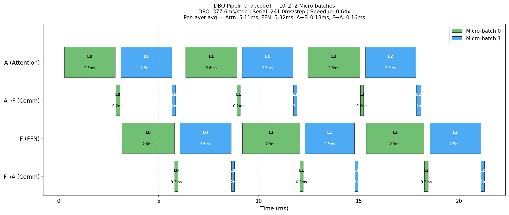

## `decode-dbo_b4_s256_t20`

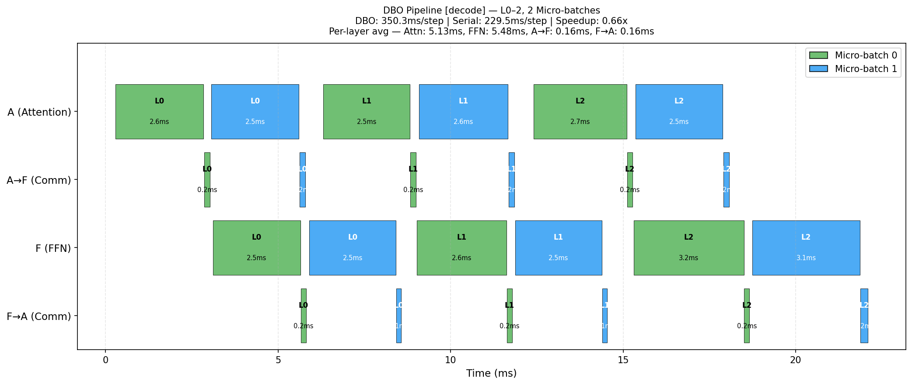

## `decode-dbo_b4_s512_t20`

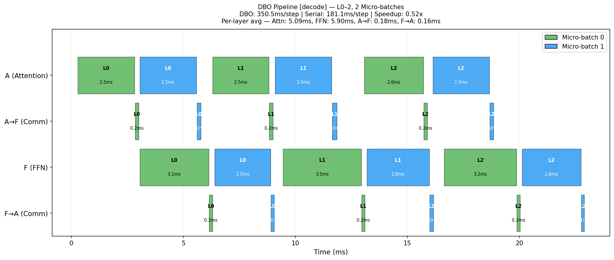

## `decode-dbo_b64_s128_t20`

## `decode-dbo_b64_s256_t20`

## `decode-dbo_b64_s512_t20`

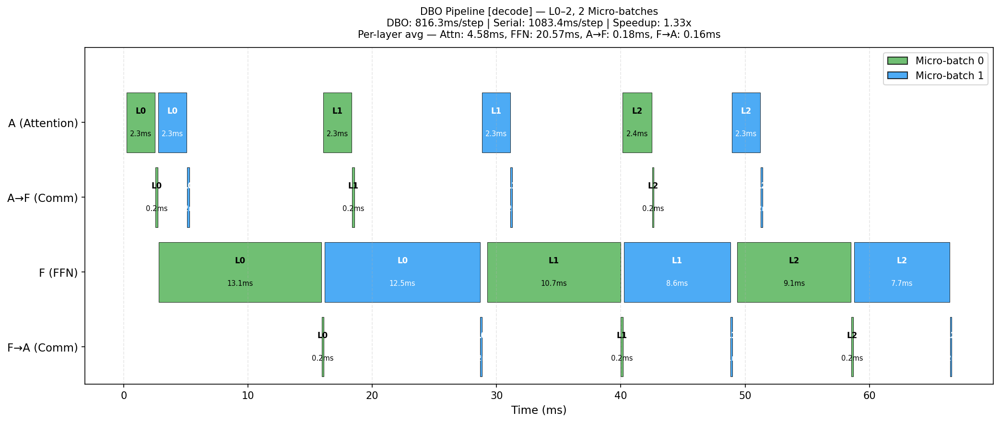

## `decode-dbo_b8_s128_t20`

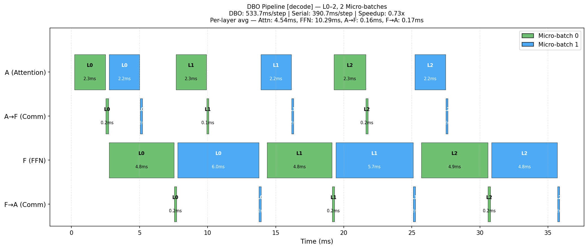

## `decode-dbo_b8_s256_t20`

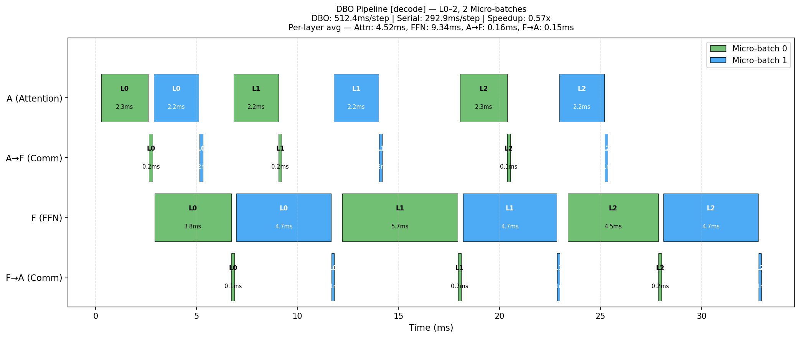

## `decode-dbo_b8_s512_t20`

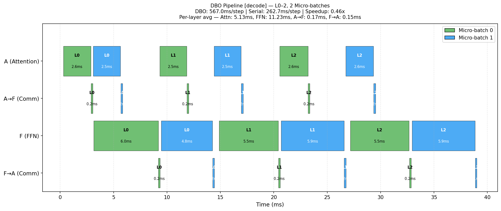

## `decode-dbo_b96_s128_t20`

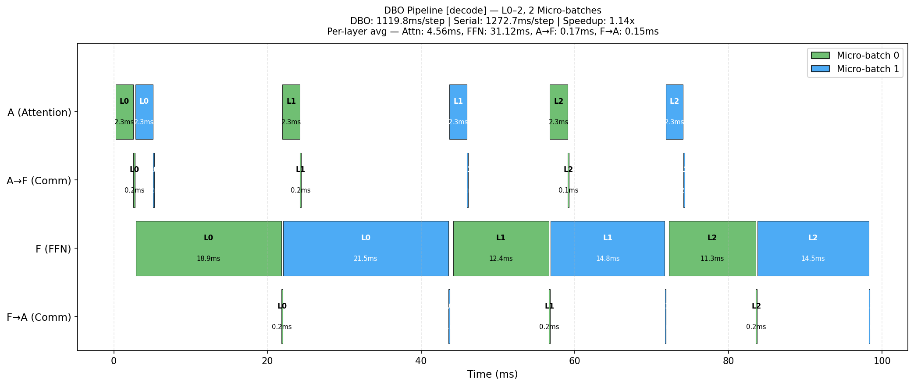

## `decode-dbo_b96_s256_t20`

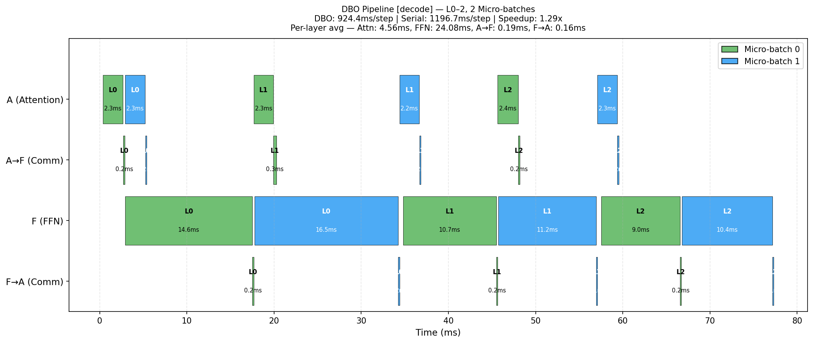

## `decode-dbo_b96_s512_t20`

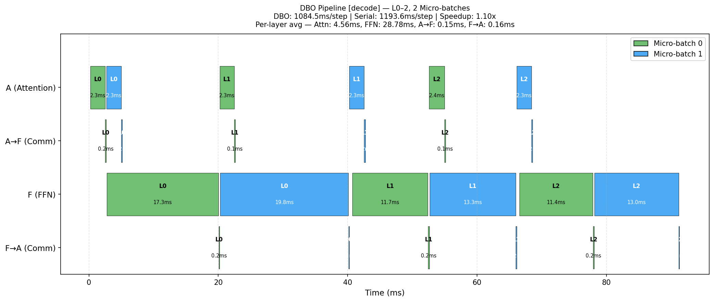

