# Pipeline figures — prefill-dbo

## `prefill-dbo_b16_s128_t20`

## `prefill-dbo_b16_s256_t20`

## `prefill-dbo_b16_s512_t20`

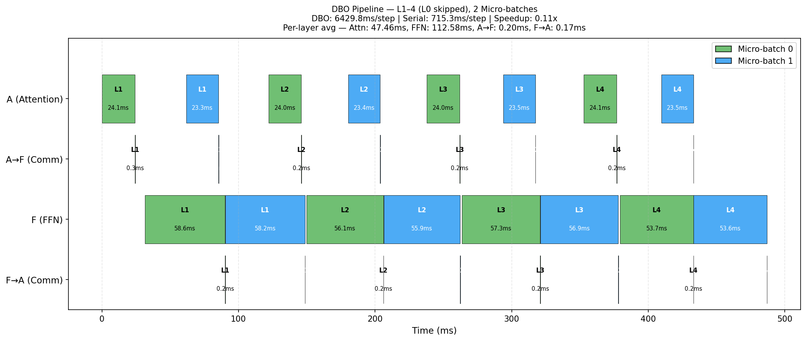

## `prefill-dbo_b2_s1024_t20`

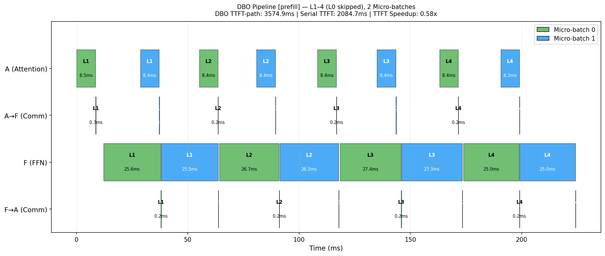

## `prefill-dbo_b2_s128_t20`

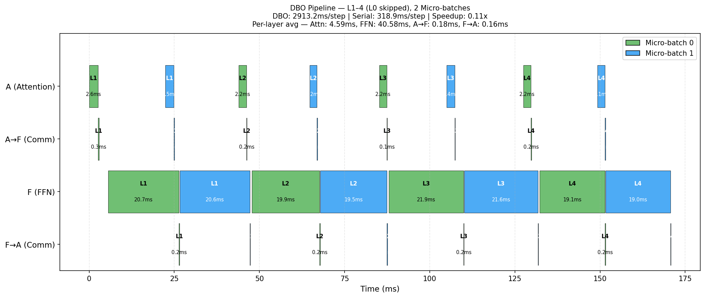

## `prefill-dbo_b2_s2048_t20`

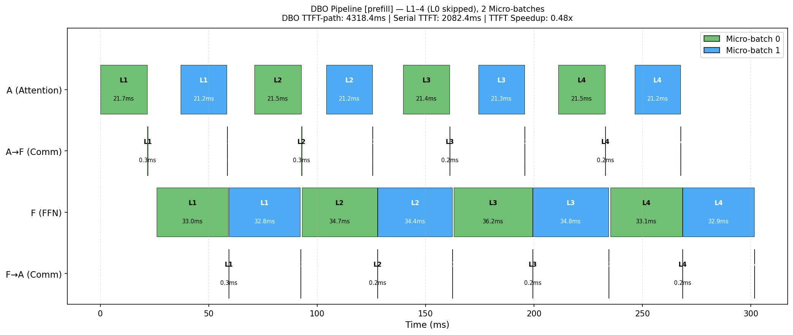

## `prefill-dbo_b2_s256_t20`

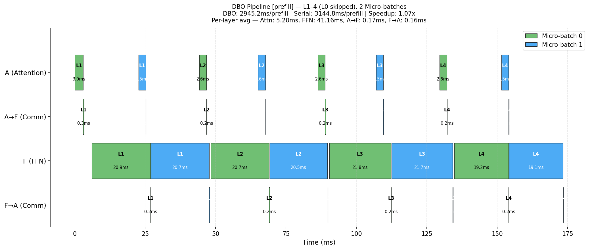

## `prefill-dbo_b2_s512_t20`

## `prefill-dbo_b32_s128_t20`

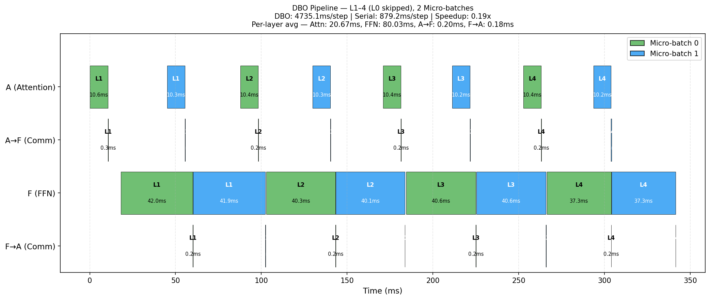

## `prefill-dbo_b32_s256_t20`

## `prefill-dbo_b4_s1024_t20`

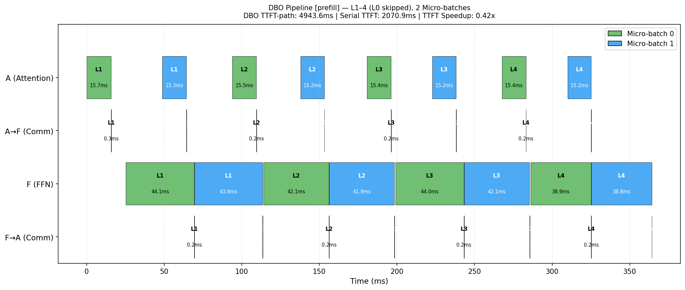

## `prefill-dbo_b4_s128_t20`

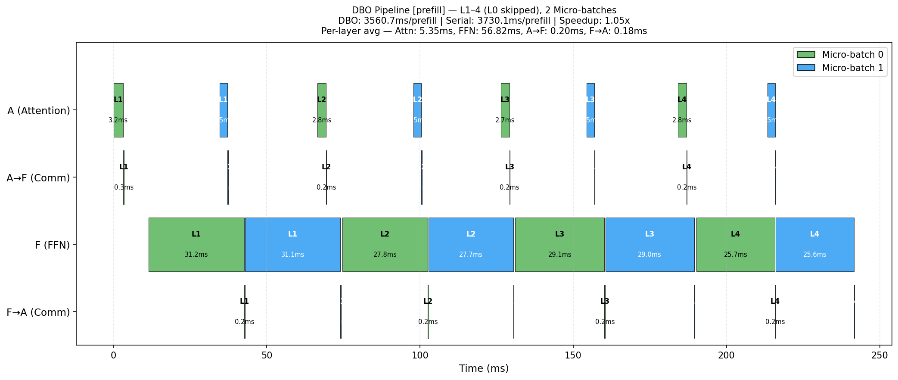

## `prefill-dbo_b4_s2048_t20`

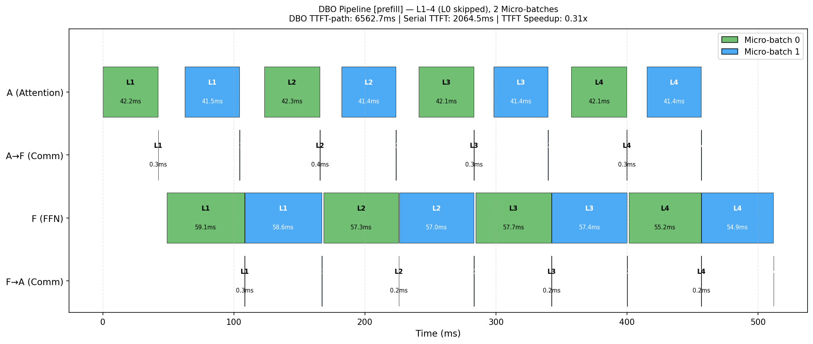

## `prefill-dbo_b4_s256_t20`

## `prefill-dbo_b4_s512_t20`

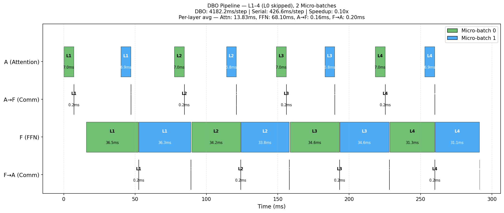

## `prefill-dbo_b64_s128_t20`

## `prefill-dbo_b8_s1024_t20`

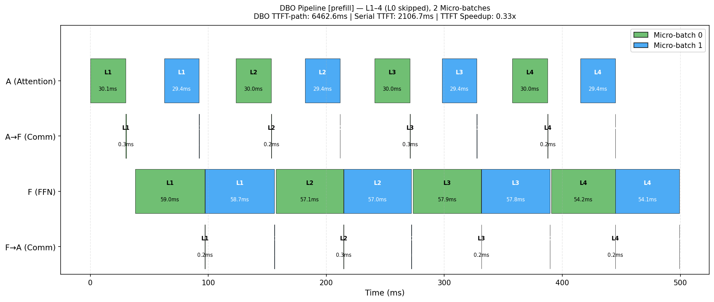

## `prefill-dbo_b8_s128_t20`

## `prefill-dbo_b8_s256_t20`

## `prefill-dbo_b8_s512_t20`

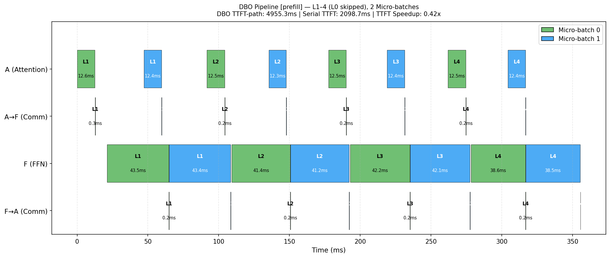

